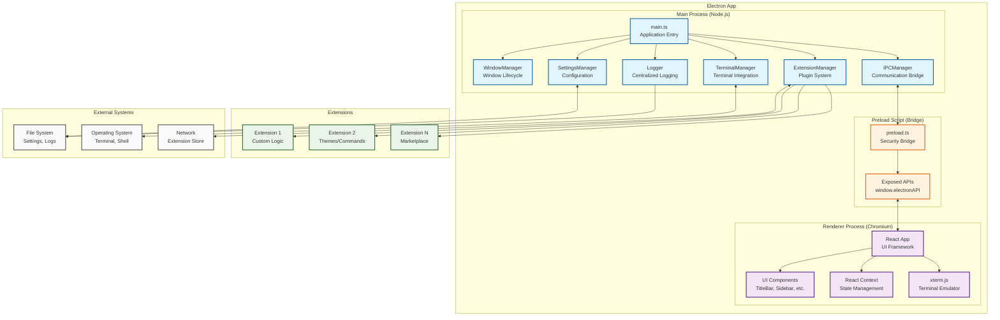
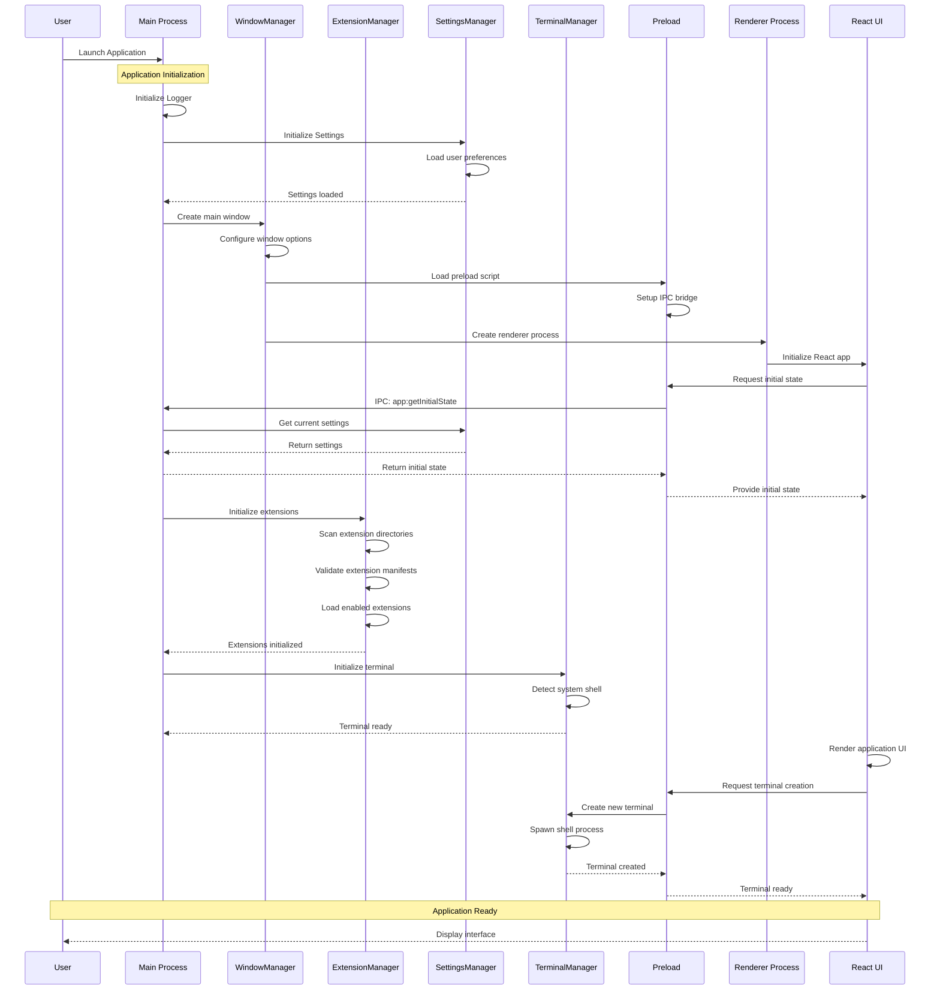
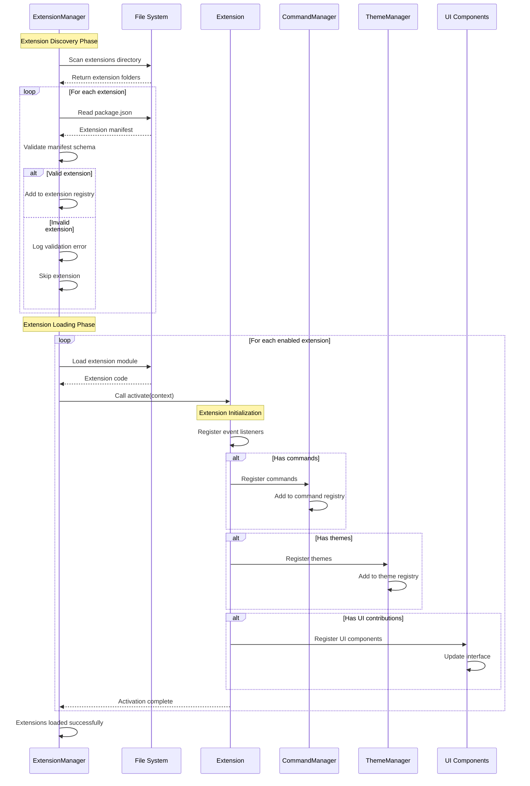
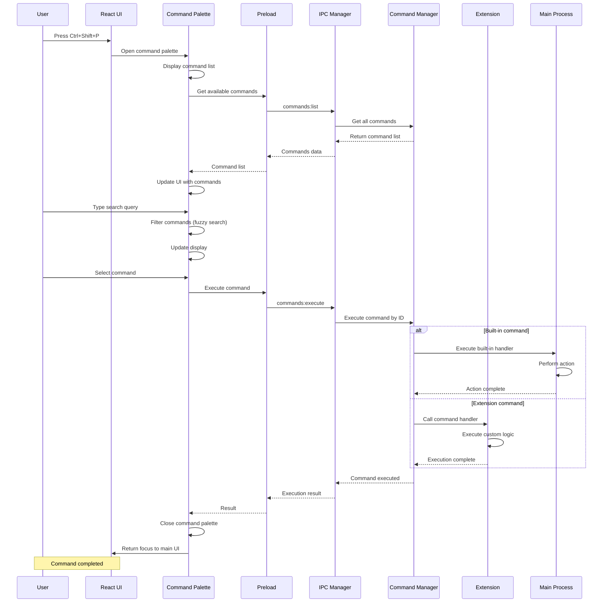
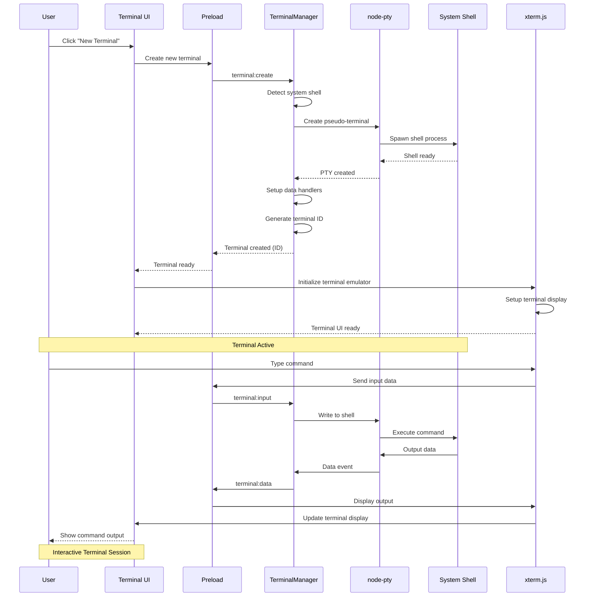
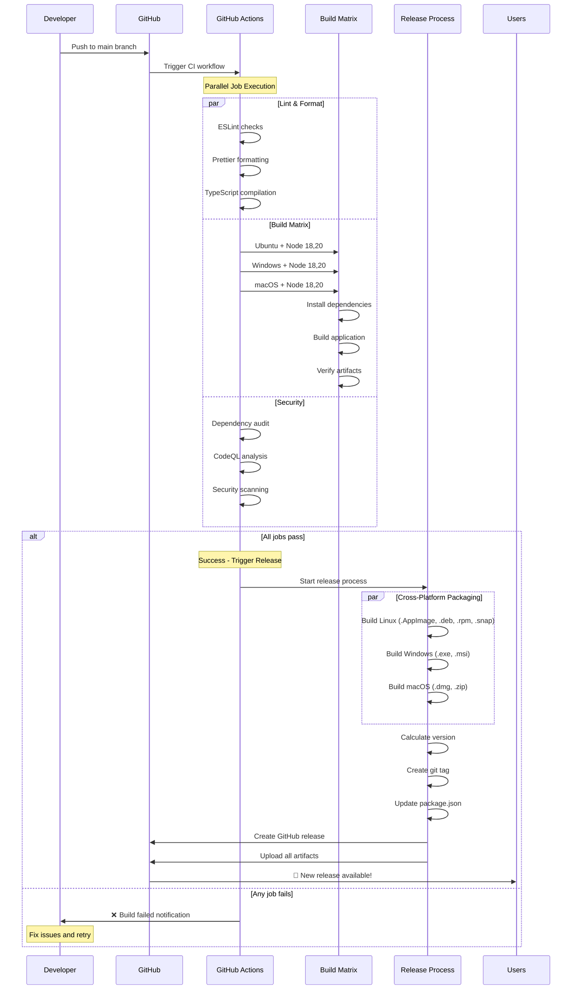

# App Shell

[](https://github.com/Lukeus/app-shell/actions/workflows/ci.yml)
[](https://github.com/Lukeus/app-shell/actions/workflows/electron-release.yml)
[](https://github.com/Lukeus/app-shell/actions/workflows/codeql.yml)

[](https://github.com/Lukeus/app-shell/releases/latest)
[](https://github.com/Lukeus/app-shell/releases)
[](https://github.com/Lukeus/app-shell/issues)
[](https://github.com/Lukeus/app-shell/pulls)

[](https://www.typescriptlang.org/)
[](https://www.electronjs.org/)
[](https://reactjs.org/)
[](https://tailwindcss.com/)
[](https://nodejs.org/)
[](https://pnpm.io/)

[](#getting-started)
[](#getting-started)
[](LICENSE)
[](CODE_OF_CONDUCT.md)

An enterprise-grade, cross-platform Electron application shell with extension support - similar to VS Code but designed as a reusable template for building extensible desktop applications.

## Preview

Coming soon.

## 📥 Download

[](https://github.com/Lukeus/app-shell/releases/latest)

**Quick Downloads:**

| Platform                                                                             | Package                                                                                                                                                                                                                                                     | Architecture |
| ------------------------------------------------------------------------------------ | ----------------------------------------------------------------------------------------------------------------------------------------------------------------------------------------------------------------------------------------------------------- | ------------ |
|  | [.exe Installer](https://github.com/Lukeus/app-shell/releases/latest) • [.msi Package](https://github.com/Lukeus/app-shell/releases/latest)                                                                                                                 | x64, ARM64   |
|        | [.dmg Disk Image](https://github.com/Lukeus/app-shell/releases/latest) • [.zip Archive](https://github.com/Lukeus/app-shell/releases/latest)                                                                                                                | x64, ARM64   |
|        | [.AppImage](https://github.com/Lukeus/app-shell/releases/latest) • [.deb](https://github.com/Lukeus/app-shell/releases/latest) • [.rpm](https://github.com/Lukeus/app-shell/releases/latest) • [.snap](https://github.com/Lukeus/app-shell/releases/latest) | x64, ARM64   |

> **Note:** Releases are automatically built and published when changes are pushed to the main branch. All packages are code-signed and verified.

## Features

### 🎯 Core Features

- **Cross-platform**: Works on Windows, macOS, and Linux
- **Extension System**: VS Code-style extension architecture
- **Command Palette**: Searchable command interface
- **Integrated Terminal**: OS-native terminal with xterm.js
- **Theme System**: Light/dark themes with full customization
- **Settings Management**: Persistent configuration with UI
- **Extension Store**: Built-in marketplace for extensions

### 🏗️ Architecture

- **Clean Architecture**: Modular, maintainable codebase
- **TypeScript**: Full type safety throughout
- **IPC Communication**: Secure main-renderer communication
- **State Management**: Persistent application state
- **Plugin API**: Rich extension development API

#### System Architecture Overview



## 📊 Platform Flow Diagrams

### Application Startup Sequence



### Extension Loading Flow



### Command Execution Flow



### Terminal Integration Flow



## Project Status

### ✅ Completed (Foundation)

- Project structure and build configuration
- TypeScript definitions and interfaces
- Main process architecture with managers
- Cross-platform window management
- Settings persistence system
- Terminal integration framework
- Basic extension system architecture
- Secure IPC communication bridge
- Logging system with file rotation
- Theme system foundation

### 🔧 In Progress

- TypeScript compilation errors resolution
- Extension loading implementation
- Command palette system enhancements

### 📋 Next Up

1. Complete extension system implementation
2. Build command palette with fuzzy search
3. Create settings UI with dynamic tabs
4. Implement extension store interface
5. Add comprehensive testing suite
6. Create extension development documentation

## Getting Started

### Prerequisites

- Node.js >= 18.0.0 (v20 LTS recommended)
- pnpm >= 8.0.0 (v8.14 or later recommended)

### Installation

```bash
# Clone the repository
git clone https://github.com/lukeusadams/app-shell.git
cd app-shell

# Install dependencies
pnpm install

# Start development server
pnpm dev
```

### Building

```bash
# Build for current platform
pnpm run package

# Build for specific platforms
pnpm run package:win    # Windows
pnpm run package:mac    # macOS
pnpm run package:linux  # Linux

# Build for all platforms
pnpm run package:all
```

## Development

### Project Structure

```
src/
├── main/           # Electron main process
│   ├── main.ts           # Application entry point
│   ├── window-manager.ts # Window management
│   ├── extension-manager.ts # Extension system
│   ├── terminal-manager.ts  # Terminal integration
│   └── settings-manager.ts  # Configuration
├── renderer/       # Frontend application
│   ├── index.ts          # Renderer entry point
│   ├── index.html        # Application template
│   ├── components/       # UI components
│   └── services/         # Business logic
├── preload/        # Secure IPC bridge
└── types/          # TypeScript definitions
```

### Available Scripts

```bash
pnpm dev           # Start development server
pnpm build         # Build for production
pnpm lint          # Run ESLint
pnpm lint:fix      # Fix linting issues
pnpm format        # Format code with Prettier
pnpm package       # Package for current platform
pnpm test          # Run end-to-end tests
pnpm test:headed   # Run tests in headed mode
pnpm test:ui       # Open test UI for debugging
pnpm test:debug    # Run tests in debug mode
pnpm test:report   # View test results report
pnpm screenshot    # Capture application screenshots
```

### Testing

This project includes comprehensive testing:

- **Build Verification**: Automated build testing across platforms
- **E2E Tests**: Playwright-based Electron testing (run locally with `pnpm test`)
- **Linting**: ESLint with TypeScript support (`pnpm lint`)
- **Formatting**: Prettier code formatting (`pnpm format`)
- **Security**: Automated dependency auditing

**CI/CD**: The GitHub Actions pipeline provides comprehensive automation including cross-platform builds, code quality checks, security scanning, and automatic releases.

### 🚀 CI/CD Pipeline Flow



#### Build Status

| Component        | Status                                                                                                                                                    | Description                        |
| ---------------- | --------------------------------------------------------------------------------------------------------------------------------------------------------- | ---------------------------------- |
| **Linting**      | [](https://github.com/Lukeus/app-shell/actions)               | ESLint + Prettier code quality     |
| **Build Matrix** | [](https://github.com/Lukeus/app-shell/actions)             | Cross-platform build verification  |
| **Security**     | [](https://github.com/Lukeus/app-shell/actions) | Dependency audit + CodeQL          |
| **Release**      | [](https://github.com/Lukeus/app-shell/releases)        | Automated packaging + distribution |

> 💡 **Tip**: E2E tests run locally with `pnpm test` due to Electron's complexity in CI environments. All other quality checks are automated.

## Extension Development

### Creating Extensions

Extensions are the primary way to extend the functionality of App Shell. Each extension is a directory with a `package.json` file that defines its metadata and contributions.

#### Basic Extension Structure

```
my-extension/
├── package.json      # Extension manifest
├── extension.ts      # Main extension file
├── themes/          # Theme contributions
└── commands/        # Command contributions
```

#### Example Extension Package.json

```json
{
  "name": "my-extension",
  "displayName": "My Extension",
  "version": "1.0.0",
  "description": "An example extension",
  "main": "./extension.js",
  "contributes": {
    "commands": [
      {
        "command": "myExtension.helloWorld",
        "title": "Hello World"
      }
    ],
    "themes": [
      {
        "id": "my-theme",
        "label": "My Theme",
        "path": "./themes/my-theme.json"
      }
    ]
  },
  "engines": {
    "app-shell": "^1.0.0" // Update to match your app-shell version
  }
}
```

### Extension API

Extensions have access to a rich API for interacting with the application:

```typescript
import { ExtensionContext, commands, window } from 'app-shell';

export function activate(context: ExtensionContext) {
  // Register a command
  const disposable = commands.registerCommand('myExtension.helloWorld', () => {
    window.showInformationMessage('Hello World from my extension!');
  });

  context.subscriptions.push(disposable);
}
```

## Theming

### Creating Themes

Themes define the visual appearance of the application. They are JSON files that specify colors for various UI elements.

```json
{
  "id": "my-theme",
  "name": "My Custom Theme",
  "type": "dark",
  "colors": {
    "app.background": "#1e1e1e",
    "app.foreground": "#d4d4d4",
    "panel.background": "#252526",
    "terminal.background": "#1e1e1e",
    "terminal.foreground": "#d4d4d4"
  }
}
```

## Testing

### End-to-End Testing with Playwright

App Shell uses Playwright for comprehensive end-to-end testing of the Electron application.

#### Running Tests

```bash
# Run all tests in headless mode
pnpm test

# Run tests with browser visible (helpful for debugging)
pnpm test:headed

# Open interactive test UI
pnpm test:ui

# Run specific test file
pnpm test tests/e2e/app-startup.spec.ts

# Run tests in debug mode (with debugger)
pnpm test:debug

# View test results report
pnpm test:report
```

#### Test Categories

- **Application Startup**: Tests basic app initialization, window creation, and UI structure
- **Command Palette**: Tests keyboard shortcuts, search functionality, and command execution
- **Terminal Integration**: Tests terminal panel, tab switching, and xterm.js integration

#### Writing Tests

Tests are located in the `tests/e2e/` directory and follow Playwright conventions:

```typescript
import { test, expect, _electron as electron } from '@playwright/test';

test.describe('Feature Name', () => {
  test('should do something', async () => {
    // Test implementation
  });
});
```

#### CI/CD Integration

Tests automatically run in CI with the following features:

- Retry failed tests up to 2 times
- Generate HTML and JUnit reports
- Capture screenshots and videos on failure
- Upload test artifacts

### Developer Tools

By default, the application launches without DevTools opened for a clean user experience. You can enable DevTools when needed:

```bash
# Enable DevTools via environment variable
OPEN_DEVTOOLS=true pnpm start:prod

# Enable DevTools via command line flag
pnpm start:prod -- --devtools

# In development with webpack dev server
pnpm dev  # DevTools can be toggled with F12 or Cmd+Opt+I
```

**DevTools Shortcuts:**

- **Toggle**: `F12` or `Cmd+Option+I` (macOS) / `Ctrl+Shift+I` (Windows/Linux)
- **Inspect Element**: `Cmd+Shift+C` (macOS) / `Ctrl+Shift+C` (Windows/Linux)

## Configuration

### Application Settings

App Shell uses a JSON-based configuration system. Settings can be modified through the UI or directly in the settings file.

Default settings location:

- **Windows**: `%APPDATA%/app-shell/settings.json`
- **macOS**: `~/Library/Application Support/app-shell/settings.json`
- **Linux**: `~/.config/app-shell/settings.json`

### Example Settings

```json
{
  "theme": "dark",
  "terminal": {
    "shell": "/bin/zsh",
    "fontSize": 14,
    "fontFamily": "Menlo, Monaco, monospace"
  },
  "extensions": {
    "enabled": ["extension1", "extension2"]
  }
}
```

## 🔒 Security

### Security Badges Status

| Security Check         | Status                                                                                                                                                                                             | Description                                 |
| ---------------------- | -------------------------------------------------------------------------------------------------------------------------------------------------------------------------------------------------- | ------------------------------------------- |
| **CodeQL Analysis**    | [](https://github.com/Lukeus/app-shell/actions/workflows/codeql.yml)                                                      | GitHub's semantic code analysis             |
| **Security Audit**     | [](https://github.com/Lukeus/app-shell/actions/workflows/security.yml)                                          | Automated dependency vulnerability scanning |
| **Snyk Monitoring**    | [](https://snyk.io/test/github/Lukeus/app-shell)                                                                   | Real-time vulnerability monitoring          |
| **License Compliance** | [](https://app.fossa.com/projects/git%2Bgithub.com%2FLukeus%2Fapp-shell?ref=badge_shield) | Open source license compliance              |

### Electron Security Best Practices

App Shell implements comprehensive Electron security measures:

#### ✅ **Core Security Features**

- **Context Isolation**: ✅ Enabled - Prevents access between main world and isolated world
- **Node.js Integration**: ❌ Disabled in renderers - No direct Node.js access from UI
- **Remote Module**: ❌ Disabled - No remote module usage
- **Preload Scripts**: ✅ Secure - Limited API exposure via contextBridge
- **Content Security Policy**: ✅ Implemented - Prevents XSS and code injection
- **Sandboxed Renderers**: ✅ Enabled - Renderer processes run in sandbox mode

#### 🛡️ **IPC Security**

- **Secure Channels**: All IPC communication uses predefined, validated channels
- **Input Validation**: All IPC messages are type-checked and validated
- **No Arbitrary Code**: Extension system prevents arbitrary code execution
- **Permission Model**: Extensions require explicit permissions for sensitive operations

#### 🔐 **Extension Security**

- **Manifest Validation**: All extensions must have valid manifests
- **Code Signing**: Extensions are verified before loading
- **Sandbox Isolation**: Extensions run in isolated contexts
- **API Restrictions**: Limited API surface exposed to extensions

#### 📊 **Security Monitoring**

- **Automated Scans**: Daily security audits via GitHub Actions
- **Dependency Checks**: Automated vulnerability scanning with Snyk
- **Code Analysis**: Static analysis with CodeQL
- **License Compliance**: FOSSA license scanning

### Security Reporting

Found a security issue? Please report it responsibly:

- **Email**: [security@lukeus.dev](mailto:security@lukeus.dev)
- **GPG**: Available upon request
- **Response Time**: Within 48 hours
- **Disclosure**: Coordinated disclosure preferred

See our [Security Policy](SECURITY.md) for detailed reporting guidelines.

## Contributing

1. Fork the repository
2. Create a feature branch
3. Make your changes
4. Add tests if applicable
5. Run linting and formatting
6. Submit a pull request

### Code Style

- Use TypeScript for all new code
- Follow the existing code style
- Run `pnpm lint` and `pnpm format` before committing
- Write meaningful commit messages

## License

MIT License - see LICENSE file for details.

## Roadmap

### Phase 1: Core Features (In Progress)

- [x] Basic extension system architecture
- [x] Terminal integration framework
- [x] Theme system foundation
- [ ] Complete extension system implementation
- [ ] Command palette with fuzzy search
- [ ] Settings UI with dynamic tabs

### Phase 2: Extension Ecosystem

- [ ] Plugin marketplace integration
- [ ] Extension store interface
- [ ] Developer documentation
- [ ] Sample extension templates
- [ ] Extension debugging support

### Phase 3: Advanced Features

- [ ] Multiple terminal tabs
- [ ] Workspace support
- [ ] Git integration
- [ ] File explorer
- [ ] Advanced theme system
- [ ] Performance monitoring dashboard

## Support

- **Issues**: GitHub Issues
- **Discussions**: GitHub Discussions
- **Documentation**: [Wiki](https://github.com/lukeusadams/app-shell/wiki)

---

Built with ❤️ using Electron, TypeScript, and modern web technologies.
