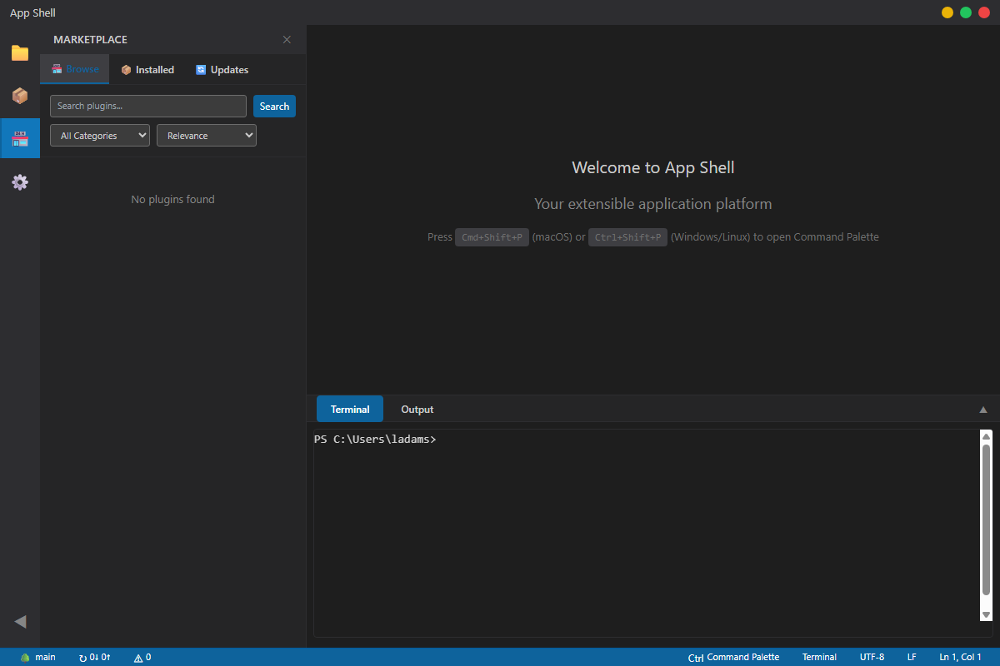

# App Shell

An enterprise-grade, cross-platform Electron application shell with extension support - similar to VS Code but designed as a reusable template for building extensible desktop applications.

## Preview


_Main interface showing the welcome screen, sidebar, and terminal panel_

<details>
<summary>🖼️ More Screenshots</summary>

### Command Palette


_Built-in command palette with fuzzy search (Cmd+Shift+P / Ctrl+Shift+P)_

### Terminal Integration


_Integrated terminal with xterm.js and OS-native shell support_

</details>

## Features

### 🎯 Core Features

- **Cross-platform**: Works on Windows, macOS, and Linux
- **Extension System**: VS Code-style extension architecture
- **Command Palette**: Searchable command interface
- **Integrated Terminal**: OS-native terminal with xterm.js
- **Theme System**: Light/dark themes with full customization
- **Settings Management**: Persistent configuration with UI
- **Extension Store**: Built-in marketplace for extensions

### 🏗️ Architecture

- **Clean Architecture**: Modular, maintainable codebase
- **TypeScript**: Full type safety throughout
- **IPC Communication**: Secure main-renderer communication
- **State Management**: Persistent application state
- **Plugin API**: Rich extension development API

## Getting Started

### Prerequisites

- Node.js >= 16.15.0
- pnpm >= 8.0.0

### Installation

```bash
# Clone the repository
git clone https://github.com/your-org/app-shell.git
cd app-shell

# Install dependencies
pnpm install

# Start development server
pnpm dev
```

### Building

```bash
# Build for current platform
pnpm run package

# Build for specific platforms
pnpm run package:win    # Windows
pnpm run package:mac    # macOS
pnpm run package:linux  # Linux

# Build for all platforms
pnpm run package:all
```

## Development

### Project Structure

```
src/
├── main/           # Electron main process
│   ├── main.ts           # Application entry point
│   ├── window-manager.ts # Window management
│   ├── extension-manager.ts # Extension system
│   ├── terminal-manager.ts  # Terminal integration
│   └── settings-manager.ts  # Configuration
├── renderer/       # Frontend application
│   ├── index.ts          # Renderer entry point
│   ├── index.html        # Application template
│   ├── components/       # UI components
│   └── services/         # Business logic
├── preload/        # Secure IPC bridge
└── types/          # TypeScript definitions
```

### Available Scripts

```bash
pnpm dev           # Start development server
pnpm build         # Build for production
pnpm lint          # Run ESLint
pnpm lint:fix      # Fix linting issues
pnpm format        # Format code with Prettier
pnpm package       # Package for current platform
pnpm test          # Run end-to-end tests
pnpm test:headed   # Run tests in headed mode
pnpm test:ui       # Open test UI for debugging
pnpm test:debug    # Run tests in debug mode
pnpm test:report   # View test results report
pnpm screenshot    # Capture application screenshots
```

## Extension Development

### Creating Extensions

Extensions are the primary way to extend the functionality of App Shell. Each extension is a directory with a `package.json` file that defines its metadata and contributions.

#### Basic Extension Structure

```
my-extension/
├── package.json      # Extension manifest
├── extension.ts      # Main extension file
├── themes/          # Theme contributions
└── commands/        # Command contributions
```

#### Example Extension Package.json

```json
{
  "name": "my-extension",
  "displayName": "My Extension",
  "version": "1.0.0",
  "description": "An example extension",
  "main": "./extension.js",
  "contributes": {
    "commands": [
      {
        "command": "myExtension.helloWorld",
        "title": "Hello World"
      }
    ],
    "themes": [
      {
        "id": "my-theme",
        "label": "My Theme",
        "path": "./themes/my-theme.json"
      }
    ]
  },
  "engines": {
    "app-shell": "^1.0.0"
  }
}
```

### Extension API

Extensions have access to a rich API for interacting with the application:

```typescript
import { ExtensionContext, commands, window } from 'app-shell';

export function activate(context: ExtensionContext) {
  // Register a command
  const disposable = commands.registerCommand('myExtension.helloWorld', () => {
    window.showInformationMessage('Hello World from my extension!');
  });

  context.subscriptions.push(disposable);
}
```

## Theming

### Creating Themes

Themes define the visual appearance of the application. They are JSON files that specify colors for various UI elements.

```json
{
  "id": "my-theme",
  "name": "My Custom Theme",
  "type": "dark",
  "colors": {
    "app.background": "#1e1e1e",
    "app.foreground": "#d4d4d4",
    "panel.background": "#252526",
    "terminal.background": "#1e1e1e",
    "terminal.foreground": "#d4d4d4"
  }
}
```

## Testing

### End-to-End Testing with Playwright

App Shell uses Playwright for comprehensive end-to-end testing of the Electron application.

#### Running Tests

```bash
# Run all tests in headless mode
pnpm test

# Run tests with browser visible (helpful for debugging)
pnpm test:headed

# Open interactive test UI
pnpm test:ui

# Run specific test file
pnpm test tests/e2e/app-startup.spec.ts

# Run tests in debug mode (with debugger)
pnpm test:debug

# View test results report
pnpm test:report
```

#### Test Categories

- **Application Startup**: Tests basic app initialization, window creation, and UI structure
- **Command Palette**: Tests keyboard shortcuts, search functionality, and command execution
- **Terminal Integration**: Tests terminal panel, tab switching, and xterm.js integration

#### Writing Tests

Tests are located in the `tests/e2e/` directory and follow Playwright conventions:

```typescript
import { test, expect, _electron as electron } from '@playwright/test';

test.describe('Feature Name', () => {
  test('should do something', async () => {
    // Test implementation
  });
});
```

#### CI/CD Integration

Tests automatically run in CI with the following features:

- Retry failed tests up to 2 times
- Generate HTML and JUnit reports
- Capture screenshots and videos on failure
- Upload test artifacts

### Developer Tools

By default, the application launches without DevTools opened for a clean user experience. You can enable DevTools when needed:

```bash
# Enable DevTools via environment variable
OPEN_DEVTOOLS=true pnpm start:prod

# Enable DevTools via command line flag
pnpm start:prod -- --devtools

# In development with webpack dev server
pnpm dev  # DevTools can be toggled with F12 or Cmd+Opt+I
```

**DevTools Shortcuts:**

- **Toggle**: `F12` or `Cmd+Option+I` (macOS) / `Ctrl+Shift+I` (Windows/Linux)
- **Inspect Element**: `Cmd+Shift+C` (macOS) / `Ctrl+Shift+C` (Windows/Linux)

## Configuration

### Application Settings

App Shell uses a JSON-based configuration system. Settings can be modified through the UI or directly in the settings file.

Default settings location:

- **Windows**: `%APPDATA%/app-shell/settings.json`
- **macOS**: `~/Library/Application Support/app-shell/settings.json`
- **Linux**: `~/.config/app-shell/settings.json`

### Example Settings

```json
{
  "theme": "dark",
  "terminal": {
    "shell": "/bin/zsh",
    "fontSize": 14,
    "fontFamily": "Menlo, Monaco, monospace"
  },
  "extensions": {
    "enabled": ["extension1", "extension2"]
  }
}
```

## Security

App Shell follows Electron security best practices:

- Context isolation enabled
- Node.js integration disabled in renderers
- Content Security Policy implemented
- Secure IPC communication
- Sandboxed renderers

## Contributing

1. Fork the repository
2. Create a feature branch
3. Make your changes
4. Add tests if applicable
5. Run linting and formatting
6. Submit a pull request

### Code Style

- Use TypeScript for all new code
- Follow the existing code style
- Run `pnpm lint` and `pnpm format` before committing
- Write meaningful commit messages

## License

MIT License - see LICENSE file for details.

## Roadmap

- [ ] Plugin marketplace integration
- [ ] Advanced theme system
- [ ] Multiple terminal tabs
- [ ] Workspace support
- [ ] Git integration
- [ ] File explorer
- [ ] Debugging support
- [ ] Performance monitoring

## Support

- **Issues**: GitHub Issues
- **Discussions**: GitHub Discussions
- **Documentation**: [Wiki](https://github.com/your-org/app-shell/wiki)

---

Built with ❤️ using Electron, TypeScript, and modern web technologies.
