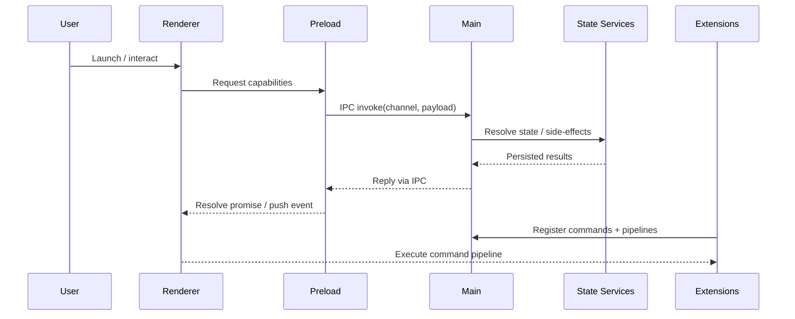
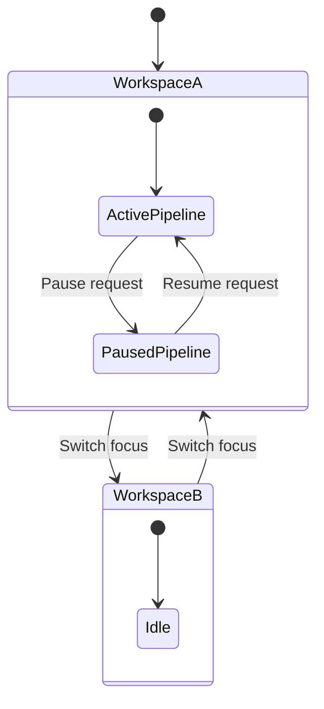
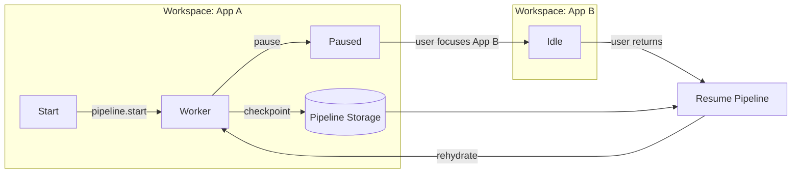
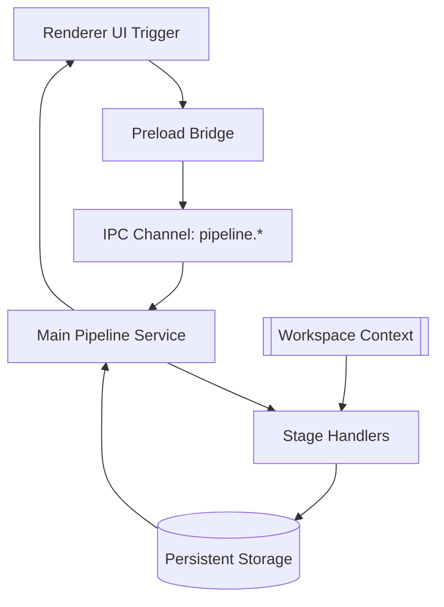

# Spec Kit Overview

This guide summarizes how the Spec Kit distribution of App Shell is structured, how data flows across the Electron processes, and how to collaborate on workspace-aware pipelines across repositories.

## 1. Architecture Summary

### 1.1 Process Topology
- **Main process (`src/main/main.ts`)** – boots the Electron app, constructs windows through the `WindowManager`, registers IPC channels, and orchestrates extension lifecycle hooks.
- **Preload bridge (`src/main/preload.ts`)** – hardens IPC boundaries, exposing a curated `window.electronAPI` surface consumed by renderer features.
- **Renderer (`src/renderer`)** – a React + Tailwind UI that renders panes, terminals, and command surfaces; state is coordinated through React contexts and persisted via settings services exposed over IPC.
- **Extension host (`src/main/extensions`)** – loads packaged extensions, isolates activation contexts, and brokers capability access (commands, theming, terminal integration).

### 1.2 Module Boundaries
- **State Services** (`src/main/services/*`): Settings, terminal, and logging managers provide stable IPC contracts for renderer and extensions.
- **Renderer Feature Slices** (`src/renderer/features/*`): Each major UX area (terminal panel, command palette, sidebar) consumes the exposed APIs while remaining renderer-only.
- **Shared Types** (`src/shared/*`): Defines serializable contracts used by main, preload, and renderer.

### 1.3 Runtime Data Flow
1. The main process receives bootstrap configuration (`app-shell.config.json` or environment defaults) and spawns the first window.
2. Preload injects capability shims (settings, workspace, logging) that proxy IPC calls into strongly-typed handlers.
3. Renderer components subscribe to contexts (e.g., `WorkspaceContext`, `TerminalContext`) to hydrate UI state and dispatch commands back across the bridge.
4. Extension activations register commands via the extension manager; these commands surface inside the renderer command palette and may call back into main services.



## 2. Workspace Semantics

### 2.1 Workspace Model
- Workspaces correspond to repository roots detected by the main process when opening folders or via `File > Open Workspace`.
- Workspace metadata (recent files, terminals, pipeline checkpoints) is persisted under the platform-specific user data directory (`app.getPath('userData')`).
- Renderer contexts expose `workspaceId` and `workspaceState`, enabling components to scope data to the active workspace.

### 2.2 Cross-Workspace Context Switching
- When switching to a different workspace window, the main process rehydrates saved state (last opened tabs, active pipelines, terminal buffers) before focusing the window.
- Renderer components listen for `workspace:changed` IPC events to refresh contexts without tearing down React trees.
- Persistent services (settings, pipelines, terminals) store per-workspace snapshots to avoid context loss when moving between `App A` and `App B` projects.



## 3. Pipeline Lifecycle Scenarios (App A vs. App B)

| Scenario | Steps | Persistence Guarantees |
| --- | --- | --- |
| **Start pipeline in App A** | 1. User invokes `Run Pipeline` command.<br>2. Renderer requests `pipeline.start` via preload.<br>3. Main process provisions a pipeline worker scoped to `workspaceId`.<br>4. Checkpoints stored in `{userData}/pipelines/<workspaceId>`. | Last-known stage, logs, and terminal scrollback recorded per checkpoint. |
| **Pause pipeline in App A, switch to App B** | 1. Renderer issues `pipeline.pause`.<br>2. Main process records current stage + state diff.<br>3. `workspace:changed` fires when user focuses App B.<br>4. App B renderer initializes its own contexts. | App A pipeline state frozen; checkpoint persisted so resume can occur later. |
| **Resume pipeline in App A after context switch** | 1. User returns to App A workspace window.<br>2. Main process rehydrates pipeline state from checkpoint.<br>3. Renderer receives `pipeline.resumed` event and restores logs/terminal buffer.<br>4. Pipeline continues without re-running completed stages. | No data loss; resumed pipeline continues from recorded checkpoint with context intact. |



## 4. Importing Upstream Updates

Follow these steps to consume changes from the upstream `github/spec-kit` repository while retaining local customizations:

1. **Configure remotes (one-time):**
   ```bash
   git remote add upstream git@github.com:github/spec-kit.git
   ```
2. **Fetch upstream updates:**
   ```bash
   git fetch upstream
   ```
3. **Review available branches/tags** (choose the appropriate release or branch):
   ```bash
   git branch -r | grep upstream/
   ```
4. **Integrate changes:**
   - For direct merges: `git merge upstream/main`
   - For curated syncs: `git cherry-pick <commit>`
   - For rebase workflows: `git rebase upstream/main`
5. **Resolve conflicts while preserving pipeline configs:**
   - Keep local `docs/spec-kit/*.md` and pipeline descriptors under `src/pipelines/` unless upstream explicitly replaces them.
   - Validate IPC contracts and shared types (`src/shared`) to ensure compatibility with pipeline customizations.
6. **Run validation suites:** `pnpm test` and targeted pipeline smoke tests before pushing.

## 5. Customizing Pipelines

1. **Define pipeline descriptors** under `src/pipelines/<workspace>/pipeline.json`, describing stages, inputs, and checkpoint strategy.
2. **Implement stage handlers** in `src/main/pipelines/<workspace>/<stage>.ts`; handlers should be idempotent and accept serialized workspace context.
3. **Expose renderer triggers** (buttons, command palette entries) within `src/renderer/features/pipelines` to start/pause/resume pipelines.
4. **Register IPC handlers** in the main process (`src/main/ipc/pipelines.ts`) to validate payloads and enforce workspace scoping.
5. **Persist checkpoints** via the pipeline service so that context is recoverable after app restarts or workspace switches.
6. **Document pipeline behavior** in `docs/spec-kit/` to keep team knowledge aligned.



## 6. State Persistence & Repo Integration Highlights

- **State Persistence:** All critical runtime state (settings, terminals, pipelines, extensions) is stored in workspace-scoped directories under `userData`, enabling warm restarts and cross-workspace recovery.
- **Context Switching:** Pipeline services subscribe to window focus events and emit pause/resume notifications, ensuring no duplicate workers run across workspaces.
- **Repo Integration:** Workspace initialization reads `.spec-kit.yml` (if present) to pre-load pipeline defaults and integration hooks that map to upstream `github/spec-kit` conventions.

> Keep this document updated as pipeline capabilities evolve. For detailed API references, consult the source files noted above and the extension development documentation in `docs/`.
